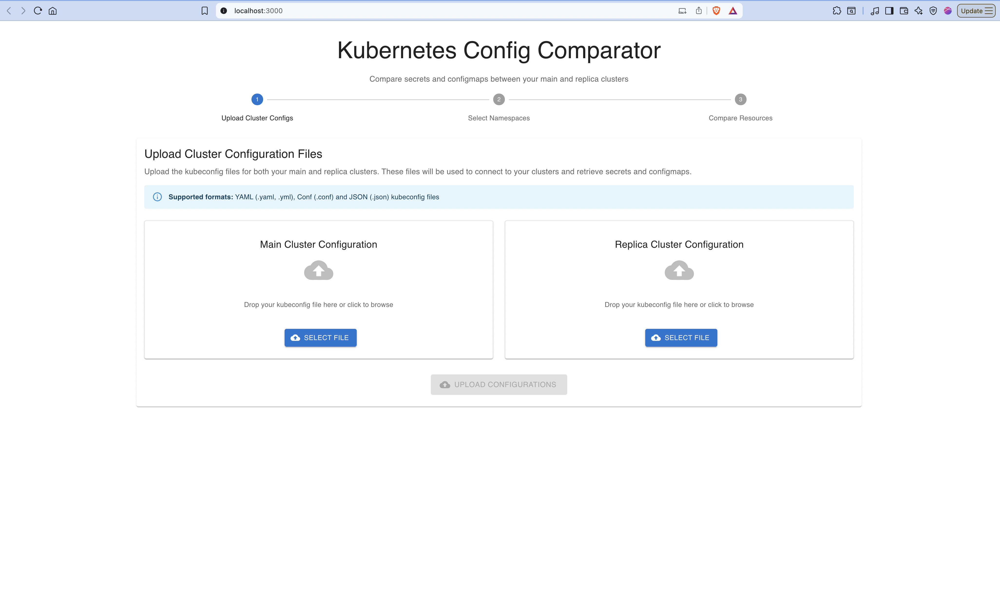
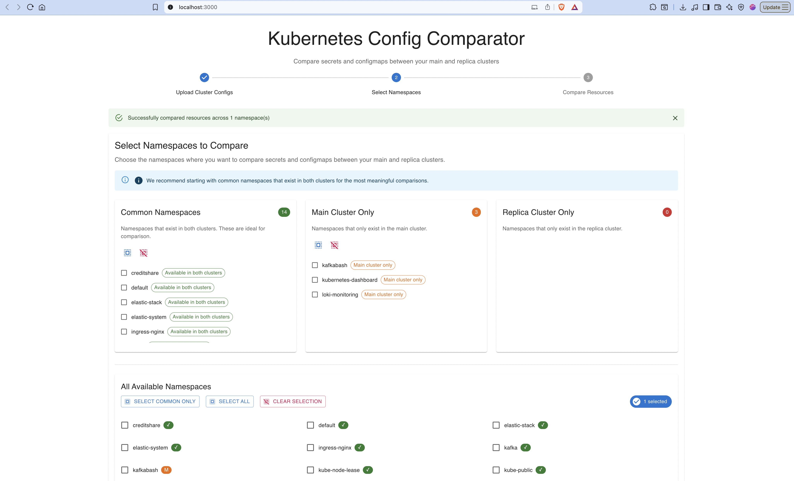
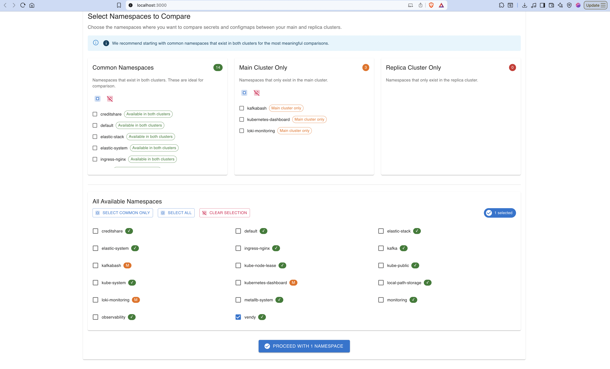
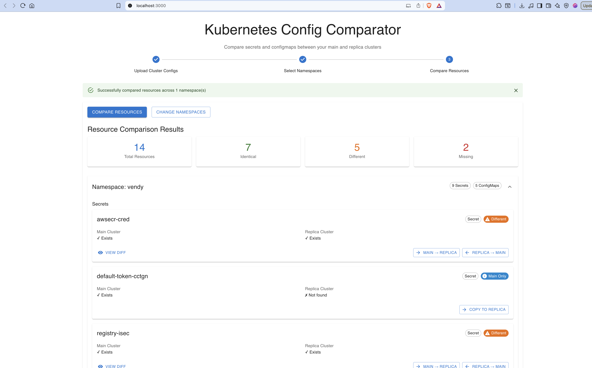

# Kubernetes Config Comparator

A full-stack web application for comparing secrets and configmaps between Kubernetes clusters. Built with React (TypeScript) frontend and Node.js backend.

## Features

- **Cluster Configuration Upload**: Upload kubeconfig files for main and replica clusters
- **Namespace Selection**: Choose which namespaces to compare between clusters
- **Resource Comparison**: Compare secrets and configmaps with detailed status indicators
- **Side-by-Side Diff Viewer**: Visual diff display using diff2html for changed resources
- **Apply Changes**: Copy resources between clusters with confirmation dialogs
- **Comprehensive UI**: Material-UI based interface with step-by-step workflow

## This is not production-ready and has no authentication or authorization, only use in secure environments

## Security Considerations

- Kubeconfig files are stored in memory only and not persisted
- All cluster communications use the official Kubernetes client library
- CORS is configured for development (adjust for production)
- Consider running in a secure environment when handling production clusters


## Images







## Installation & Setup

### Prerequisites
- Node.js 16+ and npm
- Valid kubeconfig files for your Kubernetes clusters
- Clusters should be accessible from your development environment

### 1. Install Dependencies

```bash
# Install backend dependencies
npm install

# Install frontend dependencies
npm run install:frontend
```

### 2. Development Mode

Start both backend and frontend in development mode:

```bash
npm run dev
```

This will start:
- Backend server on `http://localhost:3001`
- Frontend development server on `http://localhost:3000`

### 3. Production Build

```bash
# Build both backend and frontend
npm run build

# Start production server
npm start
```

## Usage Instructions

### Step 1: Upload Cluster Configurations
1. Navigate to the application in your browser
2. Upload kubeconfig files for both your main and replica clusters
3. The application will validate the configurations and establish connections

### Step 2: Select Namespaces
1. Review the available namespaces from both clusters
2. Select which namespaces you want to compare
3. The interface highlights common namespaces for easier selection

### Step 3: Compare Resources
1. Click "Compare Resources" to analyze secrets and configmaps
2. Review the comparison results organized by namespace
3. View detailed statistics: identical, different, and missing resources

### Step 4: Apply Changes
1. For different resources, click "View Diff" to see detailed changes
2. Use "Apply Changes" buttons to copy resources between clusters
3. Confirm changes in the dialog before applying

## API Endpoints

### POST `/api/upload-config`
Upload kubeconfig files for main and replica clusters
- **Body**: Form data with `mainConfig` and `replicaConfig` files
- **Response**: Success status and cluster connection info

### GET `/api/namespaces`
Get list of namespaces from both clusters
- **Response**: Object with `mainNamespaces`, `replicaNamespaces`, and `commonNamespaces`

### POST `/api/compare-resources`
Compare secrets and configmaps in specified namespaces
- **Body**: `{ namespaces: string[] }`
- **Response**: Detailed comparison results with diffs

### POST `/api/apply-changes`
Apply resource changes between clusters
- **Body**: `{ resourceName, resourceType, namespace, direction, resourceData }`
- **Response**: Success confirmation

### GET `/api/health`
Health check endpoint
- **Response**: Server status and timestamp

## Resource Status Types

- **Identical**: Resource exists in both clusters with same content
- **Different**: Resource exists in both clusters but with different content
- **Main Only**: Resource exists only in the main cluster
- **Replica Only**: Resource exists only in the replica cluster

## Architecture

### Backend (Node.js + TypeScript)
- **Express.js** server with REST API endpoints
- **Kubernetes Client** integration for cluster communication
- **File Upload** handling with multer
- **Diff Generation** using the diff library
- **CORS** enabled for frontend communication

### Frontend (React + TypeScript)
- **Material-UI** components for modern, responsive design
- **Step-by-step wizard** interface for guided workflow
- **Real-time feedback** with loading states and error handling
- **Interactive diff viewer** with apply changes functionality
- **Responsive design** that works on desktop and mobile


## Development Scripts

```bash
npm run dev              # Start both backend and frontend in dev mode
npm run dev:backend      # Start only backend in dev mode
npm run dev:frontend     # Start only frontend in dev mode
npm run build           # Build both backend and frontend
npm run build:backend   # Build only backend
npm run build:frontend  # Build only frontend
npm start              # Start production server
```

## Technology Stack

### Backend
- Node.js + TypeScript
- Express.js
- @kubernetes/client-node
- multer (file upload)
- diff (diff generation)
- cors

### Frontend
- React 19 + TypeScript
- Material-UI (MUI)
- axios (HTTP client)
- diff2html (diff visualization)

## Troubleshooting

### Common Issues

1. **Connection Failed**: Ensure kubeconfig files are valid and clusters are accessible
2. **Permission Denied**: Verify that the kubeconfig has sufficient permissions to list secrets/configmaps
3. **Build Errors**: Check Node.js version (16+ required) and ensure all dependencies are installed

### Logs
- Backend logs are displayed in the terminal where the server is running
- Frontend errors can be viewed in the browser's developer console

## Contributing

1. Fork the repository
2. Create a feature branch
3. Make your changes
4. Add tests if applicable
5. Submit a pull request

## License

This project is licensed under the MIT License.
